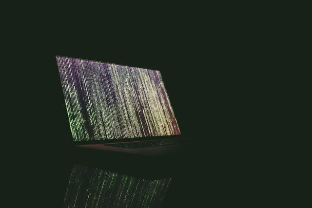

# HARI KIRAN REDDY, MUDIPALLI
* An Aspiring Data Science graduate student

# Education
* Master of Science in Data Science, *Indiana University, Bloomington*, Jan 2021 - Dec 2022  
  *Luddy School of Informatics, Computing, and Engineering* 
  - *Cumulative GPA - 3.9 / 4*
  - Course work: Applied Algorithms, Introduction to Statistics, Machine Learning for Signal Processing
* Bachelor of Technology in Electronics and Communication Engineering, *CVR College of Engineering, India*, Aug 2015 - June 2019  
  - *GPA - 7.4 / 10*

# Experience
## Graduate Research Assistant, May 2021 - *present*
### *Kelley School of Business, Indiana University*
- Working with Special Purpose Acquisition Company (SPAC) and Initial Public Offering (IPO) data to draw insights like gender ratio, educational backgrounds, previous companies, etc.
- Libraries used: StanfordcoreNLP, Spacy, pandas, numpy, Tableau
- Input: Biography text
- Output: pandas dataframe with named entity recognized columns like Name, Degree, Institute, etc.

## Junior Data Scientist (Freelancer),       June 2020 - September 2020
### *Rentastico (OPC) Pvt. Ltd.*
- Developed a chat bot using Rasa NLU framework to Automate answering customer queries and involved in
integrating the chatbot into the website.
- Developed a chat bot using Rasa NLU framework to Automate answering customer queries and involved in
integrating the chatbot into the website.
- Developed a FaceID login system prototype using openCV
- Involved in development of the Travel package recommendation system where users are recommended with
appropriate packages containing hotels, flights, etc., based on user preferences and other general customer
data.

# [Project 1: Microsoft Malware Prediction](https://github.com/harikiran-mudipalli/Microsoft_Malware_Detection/blob/master/msmp.ipynb) 
*Oct 2019*

photo by <a href="https://unsplash.com/@markusspiske">Markus Spiske</a> on <a href="https://unsplash.com/photos/uPXs5Vx5bIg">Unsplash</a>

The goal of this project is to predict the probability of a Windows Machine getting infected with a malware. The training dataset had around 9 million examples and 80 features on which I have performed Exploratory Data Analysis and Data Cleaning, and applied classification algorithms for predictions.

* **Python Libraries used:** pandas, numpy, seaborn, matplotlib, sklearn

# [project 2: Flu Shot Learning](https://github.com/harikiran-mudipalli/Flu_Shot_Learning/blob/master/EDA%20and%20Cleaning.ipynb)
*Jan 2020*

photo by <a href="https://unsplash.com/@itssammoqadam">Sam Moqadam
</a> on <a href="https://unsplash.com/photos/2rrsfMN4hn8">Unsplash</a>

**Goal:** To predict whether people got H1N1 and seasonal flu vaccines using information they shared about their backgrounds, opinions, and health behaviors

# [Project 3: Dog breed Classifier](https://github.com/harikiran-mudipalli/ImageClassifierAIPND)
*April 2020*

photo by <a href="https://unsplash.com/@andreaelphotography">Sam Moqadam
</a> on <a href="https://unsplash.com/photos/tKWJFY4wAXE">Unsplash</a>

I Should admit that I'm a dog lover and that motivated me to build this project to classify breed of a dog when a dog image is provided as an Input.

# [Project 4: FaceID login System using openCV](https://github.com/harikiran-mudipalli/FaceID_Login_openCV)
*July 2020*

photo from <a href="https://www.pcmag.com/how-to/how-to-log-into-websites-with-face-id-on-iphone-x">pcmag</a>
